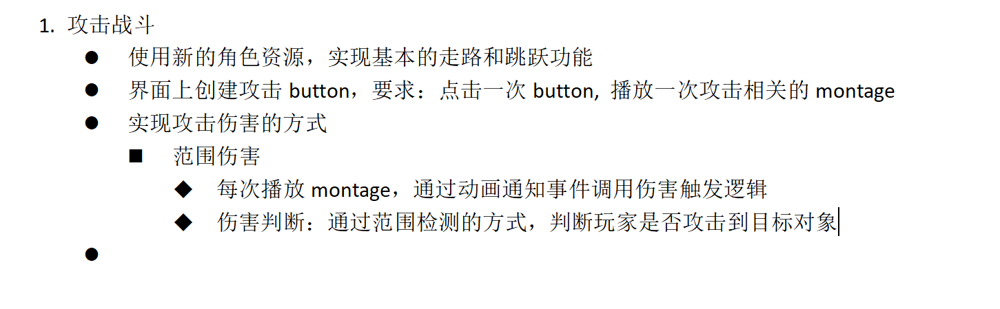
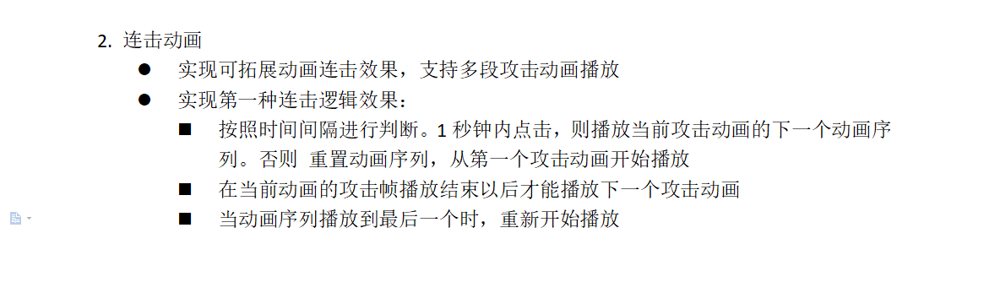
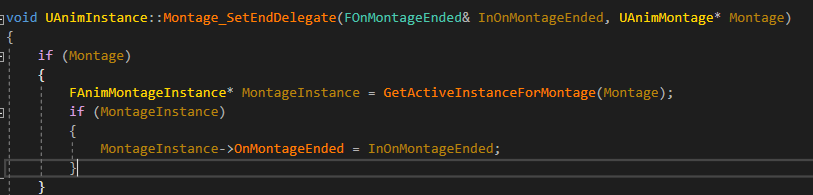
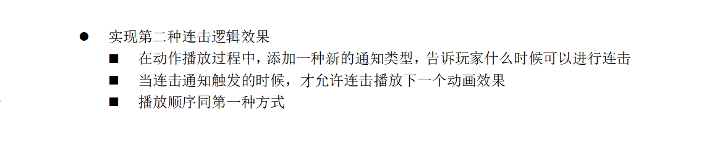
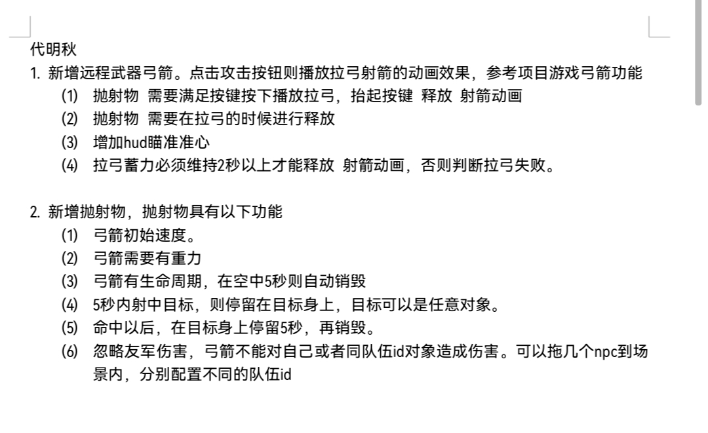
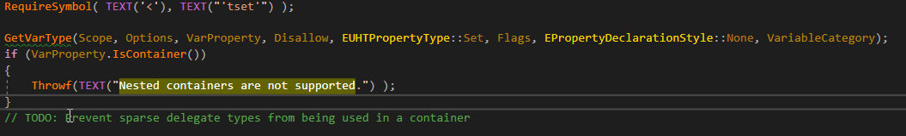

### 修改

#### 2022/9/15 12:00

1、通过角色去检测NPC进行交互（其他游戏也是通过角色检测，射线还是盒子？）
（游戏中和物品交互是通过角色碰撞体去检测；和NPC交互是通过摄像机射线检测）
2、UI控件的绑定通过GetFromName，并加指针保护
3、传入角色和NPC指针进去进行数据的读取，以及区分 枚举
4、传入结构体开销问题
5、设计“任务”结构，实现进度功能

#### 2022/9/20 18:00

1、控件一般都是用完就扔的，不需要用对象池存起来，否则会有很多问题（我自己也感受到了）（Addchild的时候会把UI的construct函数再调用一遍）
2、调整显示按钮关闭任务界面，以手游的模式开发，和NPC交互通过UI按钮绑定
3、扩展：3D位置的转换为2D的UI，比如NPC头上的提示，可以根据角色的位置和摄像机朝向来改变UI生成的位置和大小
4、修改检测机制，只在自己客户端执行，不在网络上执行
5、Tick换成Timer

#### 2022/9/26 11:00

1、延伸任务系统（击杀NPC、拾取物品、走到指定地点）
击杀NPC：角色攻击、添加伤害通知、减少血量至死亡，通知任务系统更新

问题：角色身上的capsule为什么会自动适应骨骼大小，我通过查代码CapsuleComponent->InitCapsuleSize(34.0f, 88.0f);



#### 2022/10/8 国庆回来

##### 第一种连击效果



###### 给动画蒙太奇添加中断以及结束委托函数通知

蓝图中的PlayMontage的回调函数，这个函数只能在蓝图中使用，它的接口函数都是私有的；如何在c++中使用呢，首先它对应的是c++的`PlayMontageCallbackProxy.h`文件中的函数，

```c++
// Called to perform the query internally 给蓝图脚本语言查询使用的
	UFUNCTION(BlueprintCallable, meta = (BlueprintInternalUseOnly = "true"))
	static UPlayMontageCallbackProxy* CreateProxyObjectForPlayMontage(...);------------>

//这个函数类部是调用这个函数，只用看里面关键的代码，AnimInstance->Montage_SetBlendingOutDelegate(BlendingOutDelegate, MontageToPlay);
void PlayMontage(
		class USkeletalMeshComponent* InSkeletalMeshComponent,
		class UAnimMontage* MontageToPlay,
		float PlayRate = 1.f,
		float StartingPosition = 0.f,
		FName StartingSection = NAME_None);
{
    //先获取到角色的动画实例
	if (UAnimInstance* AnimInstance = InSkeletalMeshComponent->GetAnimInstance())
	{
		//.....
        
        //获取到动画实例后，调用函数进行委托绑定，这里的委托变量，可以自己定义一个然后进行绑定
        BlendingOutDelegate.BindUObject(this, &UPlayMontageCallbackProxy::OnMontageBlendingOut);
		AnimInstance->Montage_SetBlendingOutDelegate(BlendingOutDelegate, MontageToPlay);
               
		MontageEndedDelegate.BindUObject(this, &UPlayMontageCallbackProxy::OnMontageEnded);
		AnimInstance->Montage_SetEndDelegate(MontageEndedDelegate, MontageToPlay);
        
        //....
	}

}
```

通过观察源码，发现其中只需要在你需要的地方声明相关的委托变量，并进行绑定你需要回调的函数

**Note：这里需要先进行Play再绑定回调函数**，否则会绑定失败，这是因为`Montage_SetEndDelegate()`函数是去内部查找这个蒙太奇对应的实例进行委托变量赋值，但是这时候没播放，就查询不到这个实例。

```c++
AnimInstance->Montage_Play(AttackMontages[CurrPlayAnimMont_Index]);

MontageEndedDelegate.BindUObject(this, &AMyTutorTestCharacter::OnMontageEnded);
AnimInstance->Montage_SetEndDelegate(MontageEndedDelegate, AttackMontages[CurrPlayAnimMont_Index]);

```



###### 修改伤害判定为每个玩家

这里可以重写OnTakeDamage函数，每个Actor都有这个函数


#### 2022.10.10



1、把武器相关的动画播放逻辑，封装到相关的武器类，实现通用功能，可以写一个接口函数

2、同一个函数当服务器和客户端执行的时候，可以执行不同的逻辑（官网文档有一个例子，[多人游戏编程快速入门指南 | 虚幻引擎文档 (unrealengine.com)](https://docs.unrealengine.com/4.27/zh-CN/InteractiveExperiences/Networking/QuickStart/)），代码中函数名规范，比如ClientPlayMontage，知道是在客户端执行

3、封装函数


#### 2022/10.17 远程武器



##### 解决方案：

切换远程武器的时候，切换相关的动画蓝图（弓箭的BlendSpace，四个方向），锁定控制视角（Use Controller DesiredRotation为true，Orient Rotation To Movent 为false），人物朝着摄像机的朝向；

制作AimOffset，通过9个动画序列位置

观察动画蓝图进行相关动画知识使用

-----


## 笔记

* 为什么TArray<>中，自己给自己加友元？
  SharedPtr在特化的时候，即编译时，对于不同的实参类型生成不同的类。
  如果不这样，由此模板生成的特定类型的类无法互相访问其他类型的类。

TWeakPtr，~~智能指针~~

<u>MVC模式</u>：
UI显示，不建议UI中去调用其他类的逻辑，但是在实际开发中，会把具体数据传入进去给UI进行相关逻辑判断

ue4服务器[^1]

[^1]:三种状态：客户端、模拟端、服务端

**创建的UE4变量指针都需要加上UPROPERY宏，让系统管理，否则会被系统错误的清理掉！！！**

DoesContainerMatchTagQuery()

[GAS技能系统介绍（一）同步](https://zhuanlan.zhihu.com/p/472109168)

复习：
RPC网络，官方文档阅读（模拟端，都触发了逻辑）
游戏编程模式复习

<details><summary><font color=darkered>override：参数类型，返回值、const修饰符都需要相同，会进行检查</font></summary>
    报错：cannot convert 'this' pointer from 'const UAS01' to 'UAS01 &'；这是因为函数被声明了为const的，
C++在调用类成员函数时会隐式的传递this指针，而将函数声明为const即相当于this指针被声明为const的，而这个被声明为const的this指针在print函数中调用getStr()时又会被传入，
这里问题就出现了，getStr()函数并没有被声明为const的，那么这里面进行参数传递的时候就会发生类型不匹配的问题，也就是这里报的错误。
</details>

c++变量后面加上“：1”位限定符，为什么要这样做呢，通过查询百度得知而且不能取地址
uint32 变量和bool变量

<font face="黑体" color=green size=5>修改Percentage变量</font>，会实时改动，这是因为通过TAttribute绑定的

### UE动画学习

unreal 动画系统学习：
1、controlrig，重定向、


<center><font color=green>动画通知、武器绑定</center>

连招系统：
按下攻击键，存储当前的状态到队列里面，并排除相同的蒙太奇，避免同一时间重复播放相同的蒙太奇；
这里排除相同的蒙太奇，可以用列表去判断；


### 暂时想到的东西

制作躲避动画

切换武器动画

拾取武器，切换武器功能

换装系统，捏脸系统

背包系统学习

任务系统学习


### 问题

UE中为什么不能嵌套容器？



UHT中不让编译过

解决办法：可以使用结构体进行转移


目前遇到的问题：

1、使用childActor组件实现组装武器会出现同步问题，如何更好实现切换武器的思路，childactor组件上给childactor赋值，但是引擎没有自动帮你把Owner设置上去

2、如何实现像动画蓝图中的给蒙太奇添加通知，在动画蓝图中调用

回去复习ue4基础，把ue整个框架结构进行复习


### 网络同步

客户端优先播放动画，服务器和模拟端进行同步

我好奇charactermovement组件的网络同步是怎么同步的？客户端优先进行同步，服务端进行校正

客户端预测，服务器